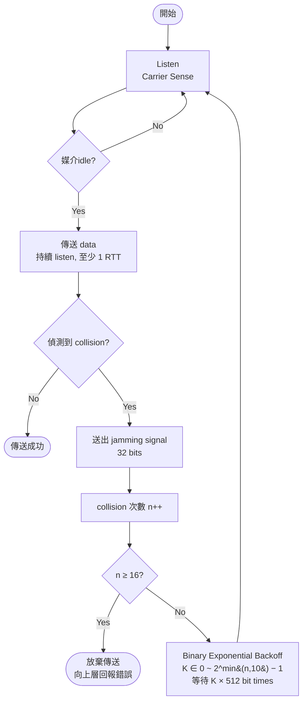

- 1 - persistent ：idle立刻傳送, **busy持續listen等到 idle**
- 0 - persistent：idle立刻傳送，**busy隨機等時間再listen**
- p - persistent：**idle 時 $p$ 的機率會傳送**，busy 持續 listen到 idle

```mermaid
flowchart TD
    A([開始]) --> B[Listen<br/>Carrier Sense]
    B --> C{媒介idle?}
    C -- No --> B
    C -- Yes --> D[傳送 data<br/>持續 listen, 至少 1 RTT]
    D --> E{偵測到 collision?}
    E -- No --> F([傳送成功])
    E -- Yes --> G[送出 jamming signal<br/>32 bits]
    G --> H[collision 次數 n++]
    H --> I{n ≥ 16?}
    I -- Yes --> J([放棄傳送<br/>向上層回報錯誤])
    I -- No --> K[Binary Exponential Backoff<br/>K ∈ 0 ~ 2^min&#40;n,10&#41; − 1<br/>等待 K × 512 bit times]
    K --> B
```
